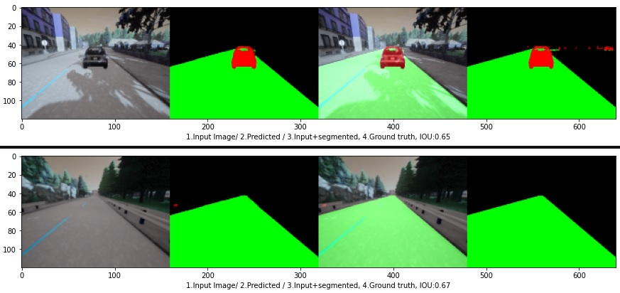

### Road segmentation with CNN

This work aims to develop a computationally small but efficient segmentation CNN to segment the road and traffic participants (vehicles + pedestrians) from the rest of the objects on the scene. The CARLA simulator [1] was used to collect the ground truth data, conisting from 3 classes. The network architecture is similar to FCN16 / 8 - architecture [2], using two skip connections.

<p align="center"> 
  </a>
  </a>
</p>


### Data collection & traning

To create a segmentation database, follow the CARLA installation guide [2]. Start the CARLA server, then the collection script ```data_collector.py```. With the script, the data can be collected automatically (autopilot drives) or manually (use: asdwq keys). To start the recording using the ```r - key```. The data will be placed in subfolders holding the ```*.rec``` files with the metadata. For full configuration options, take a look in ```recorder_config.py``` file, put the path to the carla ```.egg``` file in the configiguration file.

<p align="center"> 
  </a>
</p>


After the data was collected, use the ```road_segmentation.ipynb``` notebook, to start the network traning.
To test the trained network use the ```test_segmentation.py``` file.

##### References
1. CARLA simulator, www.arla.org
2. Fully Convolutional Networks for Semantic Segmentation, Long et all, https://arxiv.org/pdf/1411.4038.pdf

/Enjoy.